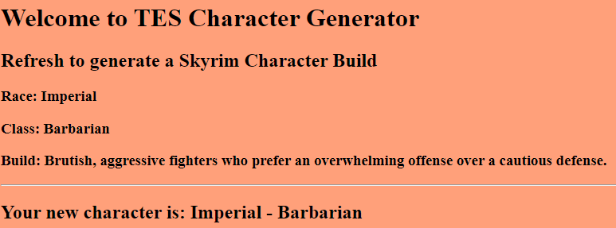

# TES Character Generator

## Contents
This is where all the documentation for the project will be:

## Brief
The brief provided for this project presented an objective to create a service-orientated architecture for an application and must be composed of at least 4 services that work together. Service 1, the frontend, is the core service- it will render the Jinja2 templates required to interact with the application. Furthermore, the service will also be responsible for communicating with the 3 backend services. Service 2 and 3 are both tasked with generating random "objects" and direct them to the (frontend service 1). Finally, Service 4 is responsible for combining Services 2 and 3's results to create an outcome of which will be sent to the frontend.  

#### Additional Requirements
In order to do this, the follwowing was required:
- An Asana board (or equivalent Kanban board tech) with full expansion on tasks needed to complete the project.
- A Risk Assessment
- An Application fully integrated using the Feature-Branch model into a Version Control System which will subsequently be built     through a CI server and deployed to a cloud-based virtual machine.
- If a change is made to a code base, then Webhooks should be used so that Jenkins recreates and redeploys the changed application
- The project must follow the Service-oriented architecture that has been asked for.
- The project must be deployed using containerisation and an orchestration tool.
- As part of the project, you need to create an Ansible Playbook that will provision the environment that your application needs to     run.
- The project must make use of a reverse proxy to make your application accessible to the user.

## My Approach
To achieve the project's objective, I decided to create a Character Generator based on Bethesda's 'The Elder Scrolls V: Skyrim'.
- Service 1:
  - The Frontend of the application and provides the Jinja2 template to display the generation page.
- Service 2:
  - Generates a random race.
- Service 3:
  - Generates a random class.
- Service 4:
  - Creates a character build and sends it to the frontend where it will be presented to the user.

## Architecture

#### Database Structure
For this project, it was required to utilise a database to persist some data in Service 1. I elected to create a simple non-relational database with one table. As shown below, a Character table was created with the attributes race, player class and build as they are all imperative to the application's main functionality. The database enabled for storing all builds generated within the application.

#### Service Architecture
In order for the application to work correctly, all four services were required to communicate accordingly. The diagram below showcases how the services interact with each other.

Breaking down the architecture of the application's services: firstly, the Frontend (Service 1) sends a 'GET' request to Services 2 and 3 in order to retrieve a randomly generated race and class, next, Services 2 and 3 adhere to this by returning a data object each at random, the Frontend then sends a 'POST' request to Service 4 with the generated race and class from the aformentioned Services. Service 4 then sends a 'POST' request back to the Fronted to return the final build for the character. Additionaly, once Service 4 has returned the final results to the Frontend based on the previous services' outcomes, the Frontend then persists the new character build into the MySQL database. Finally, the user can now access the Frontend of the application through reverse proxy, made possible by Nginx.

#### VCS- Branch Modelling
Below is my feature branch model:

Correct provisioning of the Git Feature branch model was one of the most important aspects of this project. As it required a rolling update, it was imperative that I seperated the two different implementations of the application. This meant building the first version of the application on a 'Feature-1' branch and building another feature branch ('Feature-2') from it to create the second implementation. Meanwhile, every other new implementation such as the Jenkinsfile was created on new branches and finally merged into the 'Development' branch once tested and declared ready.

#### CD (Continous Deployment) Pipeline
An indispendible part of this project is undoubtedly the CI/CD pipeline. This project elected to prioritise continous deployment. Below is an illustration of the project's continous deployment pipeline:

The pipeline is highlighted here in its fully illustrated form. It includes every framework that is utilised in order to achieve full continous deployment in every stage. 
##### Development

This begins with the development of the application in Visual Studio Code, every change made during the development stage is then pushed up to the project repository in my chosen version control system, Github. This is where all of the application's files can be stored safely and can be managed accordingly. Whenever progress is made, reference to project tracking through Trello enables for the progress to be updated based on the tasks listed from the product backlog. Work on outstanding tasks can then be retrieved in order to complete them. 
##### Automated Testing 

The CI Server, Jenkins, then creates a new build triggered via a webhook from Github after every new commit. Jenkins is responsible for running automated tests in the first stage of the build, once the tests are completed, they are tabulated and returned to Visual Studio Code with their reports. 
##### Build, Push and Configuration

The next build stage is building the application's containers and pushing the application through Docker Compose. Furthermore, once the application has been built, it's then pushed to the project's artefact repository, Docker-Hub. 
Next, Ansible automatically configures the environment for the application in order for it to run correctly. This includes intallation of all required dependencies. 
##### Deployment
Once configured, with the use of the container orchestration tool, Docker Swarm, the application deploys multiple containers across numerous host machines. Of which in this project's case is a manager node and two worker nodes. Docker Stack is also prioritised during this stage as it's tasked with enabling rolling updates to the application. Achieving continous deployment. 
##### Live Environment

At this stage, users can now access the frontend of the application through reverse proxy with Nginx as previously mentioned.

#### Jenkins Build Stages
Below is how the pipeline appears on the CI Server, the interface visually demonstrates the flow of the pipeline at each dtage:

### Project Tracking
For the project, I chose Trello as my main project tracking tool. This is where the project backlog is stored, highlighting each individual task broken down from the project epic.

### Risk Assessment
A risk assessment was created in order to monitor and plan for any potential risks that could jeaopardize the project. This proactive approach to implement the risk assessment could prevent the majority of incidents that could possibly occur during the project and minimises the likelihood and impact of those incidents. Below is the original risk assessment created during the planning stages of the project:
##### Original Risk Assessment

As I grew further into the project, I imporoved and added to the original risk assessment. It occured to me that there were certain areas within the project, especially its infrastructure that could greatly affect its success. 
##### Updated Risk Assessment

## Development
### Testing
#### Unit Testing
All testing for this project was carried out with Pytest. Unit testing was used to test each function within every route for every service. The tests were designed to verify whether the correct data is correctly inserted into the application whilst also checking if unexpected or incorrect values have been inserted. Furthermore, with the utilisation of Webhooks through Github, the unit tests were triggered automatically in Jenkins after each push to the project repository in Github. Upon completion of the tests built in Jenkins, a coverage report is also returned to the console with further information about the tests. See below for the unit tests for each service:
##### Frontend (Service 1)
The frontend unit test creates a test database using the already configured application models and populates it with a character. The unit tests written then try to verify whether the data pertaining to the character's race, class and build match the character created in the database using pytest's assert command when attempting to get a response from the 3 backend services. Antoher unit test within the frontend checks whether the requests made from the service are being successfully recieved by the http server.

##### Service 2
Service 2's unit tests are attempting to verify within the race's route function whether if a particular race that's generated at random would actually be returned if the Frontend sends a 'GET' request by requesting for the response for that class.

##### Service 3
Similar to Service 2, Service 3's unit tests are attempting to verify within the class's route function whether if a particular class that's generated at random would actually be returned if the Frontend sends a 'GET' request by requesting for the response for that class.

##### Service 4
Service 4's unit tests try to verify within the build's route function whether the correct description of the character build is created based on the data generated by the previous service

##### Test Analysis Diagrams
Using Jenkin's Cobertura plugin enabled for visual coverage reports created from automated tests. 

### Frontend
Below is the frontend page of the application that users are met. As you can see, the page has a title signifying what the application is (a Skyrim character generator) and prompts the user to refresh the page to generate a new character. The race, class and build is displayed after each generation accordingly.

### Future Improvements
- Stats or attributes depending on race or class for each character could have enabled for a more interesting experience for the users generating their characters. 
- The user interface is rather basic and could be greatly improved. As users must refresh the page externally, a button could be included to generate the characters instead.
- The ability for users to create a name for their generated characters. 
### Author
##### Tonny Allen Okech

### Acknowledgements
##### Harry Volker
##### Nathan Forester
